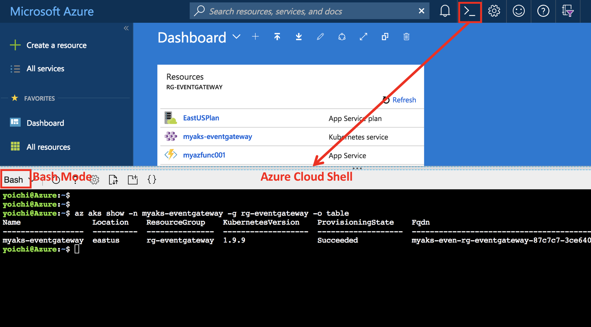
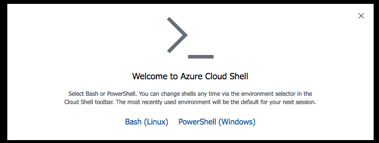
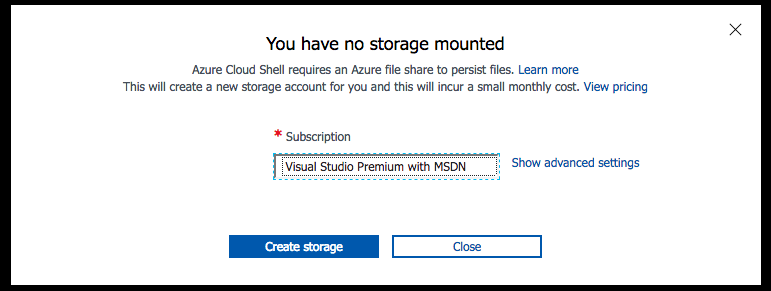

00 - Getting Started

<!-- TOC -->
- [Module00: 環境設定](#module00-%E7%92%B0%E5%A2%83%E8%A8%AD%E5%AE%9A)
  - [Azure Cloud Shellを立ち上げる](#azure-cloud-shell%E3%82%92%E7%AB%8B%E3%81%A1%E4%B8%8A%E3%81%92%E3%82%8B)
  - [Azureサブスクリプションの選択（複数ある場合のみ）](#azure%E3%82%B5%E3%83%96%E3%82%B9%E3%82%AF%E3%83%AA%E3%83%97%E3%82%B7%E3%83%A7%E3%83%B3%E3%81%AE%E9%81%B8%E6%8A%9E%E8%A4%87%E6%95%B0%E3%81%82%E3%82%8B%E5%A0%B4%E5%90%88%E3%81%AE%E3%81%BF)
  - [Register Azure Resource Providers](#register-azure-resource-providers)

## Azure Cloud Shellを立ち上げる

このハンズオンラボでは[Azure Cloud Shell (Bashモード)](https://docs.microsoft.com/en-us/azure/cloud-shell/overview)を使用して進めます。よって、まず最初にAzure Cloud ShellをBashモードで立ち上げてください



>[NOTE]: https://shell.azure.com/ にアクセスすることでフルスクリーンのAzure Cloud Shellを使うことができます

もしAzure Cloud Shellへのアクセスが初めての場合は、次のようなデータ永続化のためのAzure Fileの設定のためのプロンプトが表示されます



"Bash (Linux)"オプションをクリックして、Azureサブスクリプションを選択して、"Create Storage"をクリックします



数秒後にストレージアカウントが作成されます。これでAzure Cloud Shellを使う準備が整いました。

## Azureサブスクリプションの選択（複数ある場合のみ）

次のコマンドを実行してAzureサブスクリプション一覧を表示します

```
az account list -o table
```
> Output
```
Name                             CloudName    SubscriptionId                        State    IsDefault
-------------------------------  -----------  ------------------------------------  -------  -----------
Visual Studio Premium with MSDN  AzureCloud   xxxxxxxxxx-xxxx-xxxx-xxxx-xxxxxxxxxx  Enabled  True
Another sub1                     AzureCloud   xxxxxxxxxx-xxxx-xxxx-xxxx-xxxxxxxxxx  Enabled  False
Another sub2                     AzureCloud   xxxxxxxxxx-xxxx-xxxx-xxxx-xxxxxxxxxx  Enabled  False
Another sub3                     AzureCloud   xxxxxxxxxx-xxxx-xxxx-xxxx-xxxxxxxxxx  Enabled  False
```

もし、複数のサブスクリプションを持っている場合は、次のように利用したいサブスクリプション名をデフォルトに設定ください

```
az account set -s 'Visual Studio Premium with MSDN'
```

## Register Azure Resource Providers

このハンズオンラボではAzureのNetwork, Storage, Compute と ContainerSerivcesのリソースを管理しますが、もしお使いのサブスクリプションにおいてこれらリソース管理が初めての場合は次のコマンドを実行してリソースプロバイダーを登録ください

```sh
az provider register -n Microsoft.Network
az provider register -n Microsoft.Storage
az provider register -n Microsoft.Compute
az provider register -n Microsoft.ContainerService
```

---
[Top](../../README.md) | [Next](../01-setup-terraform/README.md)