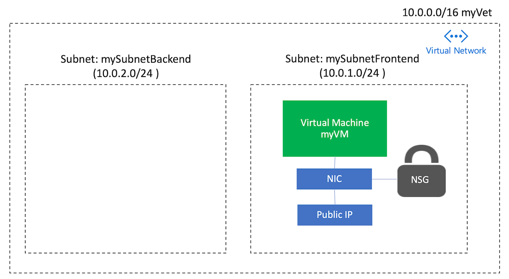

# Create a Linux VM and VNET with Terraform


- [Create a Linux VM and VNET with Terraform](#create-a-linux-vm-and-vnet-with-terraform)
    - [TerraformのAzureへのアクセス設定](#terraformのazureへのアクセス設定)
    - [SSH鍵の作成](#ssh鍵の作成)
    - [方法1: リソースを１つずつ作成する](#方法1-リソースを１つずつ作成する)
        - [リソースグループの作成](#リソースグループの作成)
        - [Virutal NetworkとSubnetの作成](#virutal-networkとsubnetの作成)
        - [パブリックIPアドレスの作成](#パブリックipアドレスの作成)
        - [Network Security Groupの作成](#network-security-groupの作成)
        - [Virtual NIC (ネットワークインターフェースカード)の作成](#virtual-nic-ネットワークインターフェースカードの作成)
        - [ストレージアカウントの作成](#ストレージアカウントの作成)
        - [Virtual Machineの作成](#virtual-machineの作成)
    - [方法2: リソースをまとめて作成する](#方法2-リソースをまとめて作成する)
    - [VMにSSHでログイン](#vmにsshでログイン)
    - [作成したリソースの削除](#作成したリソースの削除)




## TerraformのAzureへのアクセス設定

[01-Setup Terrraform](../01-setup-terraform/README.md)で作成した`setenv.sh`を次のように`source`コマンドで実行して、現在のshellプロセスに上記変数を読み込んでください。

```bash
source ./setenv.sh
```

## SSH鍵の作成

次のコマンドで2048bit長のRSA暗号化でSSH鍵のペアを作成します。
```
ssh-keygen -t rsa -b 2048
```

> 出力結果
```
ssh-keygen -t rsa -b 2048
Generating public/private rsa key pair.
Enter file in which to save the key (/home/yoichi/.ssh/id_rsa):
Enter passphrase (empty for no passphrase):
Enter same passphrase again:
Your identification has been saved in /home/yoichi/.ssh/id_rsa.
Your public key has been saved in /home/yoichi/.ssh/id_rsa.pub.
The key fingerprint is:
SHA256:wiOxdLPCnQ3mrj+q9/fwbdmss8MwQ+T+cp9lWE1jP+s yoichi@cc-808de607-5674f6dccf-bjqm4
The key's randomart image is:
+---[RSA 2048]----+
|                 |
|          .      |
|    o =  o     o.|
|   o O *  o   ..+|
|    = O So     .+|
|     + o  =    oo|
|      . .  * +..o|
|    ... .o..O ++ |
|  .oo+oo .o++*oE |
+----[SHA256]-----+
```

SSH鍵ペアが作成されていることを確認してください。
```bash
ls -la ~/.ssh

total 16
drwx------  2 yoichi yoichi 4096 Jul 30  2018 .
drwxr-xr-x 16 yoichi yoichi 4096 Jun  4 23:41 ..
-rw-------  1 yoichi yoichi 1766 Jun  5 00:56 id_rsa
-rw-r--r--  1 yoichi yoichi  417 Jun  5 00:56 id_rsa.pub
```

## 方法1: リソースを１つずつ作成する

下記ステップでは、それぞれのステップのTerraformスクリプトを[01-Setup Terraform]で実施したように初期化、実行計画作成、実行してください。
```bash
## Init Terraform deploy which actually downloads the Azure modules required to create an Azure resource group.
terraform init

## Preview the actions to be completed by the Terraform script
terraform plan

## Apply the terraform plan
terraform apply
```

### リソースグループの作成

次のTerraformスクリプトでは`tflab_02`という名前のリソースグループを`japaneast`リージョンに作成します。

> resourcegroup.tf
```
resource "azurerm_resource_group" "myterraformgroup" {
    name     = "tflab_02"
    location = "japaneast"

    tags = {
        environment = "Terraform Demo"
    }
}
```

### Virutal NetworkとSubnetの作成

次のTerraformスクリプトではVirtual Network（`myVnet`）をアドレススペース`10.0.0.0/16`で作成して、その中にサブネットを2つ(`mySubnetFrontend`と`mySubnetBackend`)を作成します。

> vnet.tf
```
# Create virtual network
resource "azurerm_virtual_network" "myterraformnetwork" {
    name                = "myVnet"
    address_space       = ["10.0.0.0/16"]
    location            = "japaneast"
    resource_group_name = "${azurerm_resource_group.myterraformgroup.name}"

    tags = {
        environment = "Terraform Demo"
    }
}

# Create subnet
resource "azurerm_subnet" "myterraformsubnet" {
    name                 = "mySubnetFrontend"
    resource_group_name  = "${azurerm_resource_group.myterraformgroup.name}"
    virtual_network_name = "${azurerm_virtual_network.myterraformnetwork.name}"
    address_prefix       = "10.0.1.0/24"
}
resource "azurerm_subnet" "myterraformsubnetbackend" {
    name                 = "mySubnetBackend"
    resource_group_name  = "${azurerm_resource_group.myterraformgroup.name}"
    virtual_network_name = "${azurerm_virtual_network.myterraformnetwork.name}"
    address_prefix       = "10.0.2.0/24"
}
```

### パブリックIPアドレスの作成

次のTerraformスクリプトではパブリックIPアドレス（`myPublicIP`）をアロケーションモード`Dynamic`で作成します。

> publicip.tf
```
# Create public IPs
resource "azurerm_public_ip" "myterraformpublicip" {
    name                         = "myPublicIP"
    location                     = "japaneast"
    resource_group_name          = "${azurerm_resource_group.myterraformgroup.name}"
    allocation_method            = "Dynamic"

    tags = {
        environment = "Terraform Demo"
    }
}
```

### Network Security Groupの作成

次のTerraformスクリプトでは`SSH`アクセス(`TCP/22`)用のNetwork Security Groupを作成します。

> nsg.tf
```
# Create Network Security Group and rule
resource "azurerm_network_security_group" "myterraformnsg" {
    name                = "myNetworkSecurityGroup"
    location            = "japaneast"
    resource_group_name = "${azurerm_resource_group.myterraformgroup.name}"

    security_rule {
        name                       = "SSH"
        priority                   = 1001
        direction                  = "Inbound"
        access                     = "Allow"
        protocol                   = "Tcp"
        source_port_range          = "*"
        destination_port_range     = "22"
        source_address_prefix      = "*"
        destination_address_prefix = "*"
    }

    tags = {
        environment = "Terraform Demo"
    }
}
```


### Virtual NIC (ネットワークインターフェースカード)の作成

次のTerraformスクリプトではあたなのVMをVirtual Network、パブリックIPやNetwork Security Groupと繋げるための仮想ネットワークインターフェースカード（Virtual NIC）を`myNIC`という名前で作成します。

> nic.tf
```
# Create network interface
resource "azurerm_network_interface" "myterraformnic" {
    name                      = "myNIC"
    location                  = "japaneast"
    resource_group_name       = "${azurerm_resource_group.myterraformgroup.name}"
    network_security_group_id = "${azurerm_network_security_group.myterraformnsg.id}"

    ip_configuration {
        name                          = "myNicConfiguration"
        subnet_id                     = "${azurerm_subnet.myterraformsubnet.id}"
        private_ip_address_allocation = "Dynamic"
        public_ip_address_id          = "${azurerm_public_ip.myterraformpublicip.id}"
    }

    tags = {
        environment = "Terraform Demo"
    }
}
```


### ストレージアカウントの作成

次のTerraformスクリプトではVMのブート診断ログを保存するためのAzureストレージアカウントを作成します。ストレージアカウント名は全体でユニークである必要があるためランダム文字列生成用のプラグインを使用しています。

>storage.tf
```
# Generate random text for a unique storage account name
resource "random_id" "randomId" {
    keepers = {
        # Generate a new ID only when a new resource group is defined
        resource_group = "${azurerm_resource_group.myterraformgroup.name}"
    }

    byte_length = 8
}

# Create storage account for boot diagnostics
resource "azurerm_storage_account" "mystorageaccount" {
    name                        = "diag${random_id.randomId.hex}"
    resource_group_name         = "${azurerm_resource_group.myterraformgroup.name}"
    location                    = "japaneast"
    account_tier                = "Standard"
    account_replication_type    = "LRS"

    tags = {
        environment = "Terraform Demo"
    }
}
```

### Virtual Machineの作成

次のTerraformスクリプトでVM(`myVM`)を作成します。VMには先ほど作成したVirtual NICをアタッチします。また、OSイメージは`Ubuntu 16.04-LTS`を使い、OSにはユーザー(`azureuser`)を作成します。

まず先ほど作成したSSH鍵（公開鍵）の内容を取得してください。
```bash
cat /.ssh/id_rsa.pub

ssh-rsa AAAAB3NzaC1yc2EAAAADAQABAAABAQDZFFzffd79MoRZtlFWMBXKnREetHFE4pqWR5pOTdS9T2t1NeX6vLDAYUPvzytDoYBKPmbfiudNWbhOydePv6N/9jdi7GMvtwB+52cGW7HNt2ii9Nt1T8M/XYmPp0Im3kiIvOIqV6cpvthJnUc4fwAOQJlvM5GdmctZXrGwONelN8rAGC4xbwwVxmuKl4dS7nLokFz+FUVl38l3BTFypTmlTLG1/DiRC5qxPhusK7GHBB70xoHGRPaah1PyOcJw+Y2RNb+vIiKvb0xwx4JQ+mQEqBLUn8GQwQkpf7DFHABh3ZBc3mJqMFAM/hWdu9BL0GJMDa32EyM5LQqI6mjQqFmT yoichi@cc-808de607-5674f6dccf-bjqm4
```

Terraformスクリプト実行前に`key_data = "ssh-rsa ************** YOUR SSH KEY ***************"`の値部分に先ほど作成したSSH鍵（公開鍵）の内容を挿入してください。

> vm.tf
```
# Create virtual machine
resource "azurerm_virtual_machine" "myterraformvm" {
    name                  = "myVM"
    location              = "japaneast"
    resource_group_name   = "${azurerm_resource_group.myterraformgroup.name}"
    network_interface_ids = ["${azurerm_network_interface.myterraformnic.id}"]
    vm_size               = "Standard_DS1_v2"

    storage_os_disk {
        name              = "myOsDisk"
        caching           = "ReadWrite"
        create_option     = "FromImage"
        managed_disk_type = "Premium_LRS"
    }

    storage_image_reference {
        publisher = "Canonical"
        offer     = "UbuntuServer"
        sku       = "16.04.0-LTS"
        version   = "latest"
    }

    os_profile {
        computer_name  = "myvm"
        admin_username = "azureuser"
    }

    os_profile_linux_config {
        disable_password_authentication = true
        ssh_keys {
            path     = "/home/azureuser/.ssh/authorized_keys"
            key_data = "ssh-rsa ************** YOUR SSH KEY ***************"
        }
    }

    boot_diagnostics {
        enabled = "true"
        storage_uri = "${azurerm_storage_account.mystorageaccount.primary_blob_endpoint}"
    }

    tags = {
        environment = "Terraform Demo"
    }
}
```

## 方法2: リソースをまとめて作成する

下記のTerraformスクリプトを[01-Setup Terraform]で実施したように初期化、実行計画作成、実行してください。
```bash
## Init Terraform deploy which actually downloads the Azure modules required to create an Azure resource group.
terraform init

## Preview the actions to be completed by the Terraform script
terraform plan

## Apply the terraform plan
terraform apply
```

> main.tf
```
# Create a resource group if it doesn’t exist
resource "azurerm_resource_group" "myterraformgroup" {
    name     = "tflab_02"
    location = "japaneast"

    tags = {
        environment = "Terraform Demo"
    }
}

# Create virtual network
resource "azurerm_virtual_network" "myterraformnetwork" {
    name                = "myVnet"
    address_space       = ["10.0.0.0/16"]
    location            = "japaneast"
    resource_group_name = "${azurerm_resource_group.myterraformgroup.name}"

    tags = {
        environment = "Terraform Demo"
    }
}

# Create subnet
resource "azurerm_subnet" "myterraformsubnet" {
    name                 = "mySubnetFrontend"
    resource_group_name  = "${azurerm_resource_group.myterraformgroup.name}"
    virtual_network_name = "${azurerm_virtual_network.myterraformnetwork.name}"
    address_prefix       = "10.0.1.0/24"
}
resource "azurerm_subnet" "myterraformsubnetbackend" {
    name                 = "mySubnetBackend"
    resource_group_name  = "${azurerm_resource_group.myterraformgroup.name}"
    virtual_network_name = "${azurerm_virtual_network.myterraformnetwork.name}"
    address_prefix       = "10.0.2.0/24"
}

# Create public IPs
resource "azurerm_public_ip" "myterraformpublicip" {
    name                         = "myPublicIP"
    location                     = "japaneast"
    resource_group_name          = "${azurerm_resource_group.myterraformgroup.name}"
    allocation_method            = "Dynamic"

    tags = {
        environment = "Terraform Demo"
    }
}

# Create Network Security Group and rule
resource "azurerm_network_security_group" "myterraformnsg" {
    name                = "myNetworkSecurityGroup"
    location            = "japaneast"
    resource_group_name = "${azurerm_resource_group.myterraformgroup.name}"
    
    security_rule {
        name                       = "SSH"
        priority                   = 1001
        direction                  = "Inbound"
        access                     = "Allow"
        protocol                   = "Tcp"
        source_port_range          = "*"
        destination_port_range     = "22"
        source_address_prefix      = "*"
        destination_address_prefix = "*"
    }

    tags = {
        environment = "Terraform Demo"
    }
}

# Create network interface
resource "azurerm_network_interface" "myterraformnic" {
    name                      = "myNIC"
    location                  = "japaneast"
    resource_group_name       = "${azurerm_resource_group.myterraformgroup.name}"
    network_security_group_id = "${azurerm_network_security_group.myterraformnsg.id}"

    ip_configuration {
        name                          = "myNicConfiguration"
        subnet_id                     = "${azurerm_subnet.myterraformsubnet.id}"
        private_ip_address_allocation = "Dynamic"
        public_ip_address_id          = "${azurerm_public_ip.myterraformpublicip.id}"
    }

    tags = {
        environment = "Terraform Demo"
    }
}

# Generate random text for a unique storage account name
resource "random_id" "randomId" {
    keepers = {
        # Generate a new ID only when a new resource group is defined
        resource_group = "${azurerm_resource_group.myterraformgroup.name}"
    }
    
    byte_length = 8
}

# Create storage account for boot diagnostics
resource "azurerm_storage_account" "mystorageaccount" {
    name                        = "diag${random_id.randomId.hex}"
    resource_group_name         = "${azurerm_resource_group.myterraformgroup.name}"
    location                    = "japaneast"
    account_tier                = "Standard"
    account_replication_type    = "LRS"

    tags = {
        environment = "Terraform Demo"
    }
}

# Create virtual machine
resource "azurerm_virtual_machine" "myterraformvm" {
    name                  = "myVM"
    location              = "japaneast"
    resource_group_name   = "${azurerm_resource_group.myterraformgroup.name}"
    network_interface_ids = ["${azurerm_network_interface.myterraformnic.id}"]
    vm_size               = "Standard_DS1_v2"

    storage_os_disk {
        name              = "myOsDisk"
        caching           = "ReadWrite"
        create_option     = "FromImage"
        managed_disk_type = "Premium_LRS"
    }

    storage_image_reference {
        publisher = "Canonical"
        offer     = "UbuntuServer"
        sku       = "16.04.0-LTS"
        version   = "latest"
    }

    os_profile {
        computer_name  = "myvm"
        admin_username = "azureuser"
    }

    os_profile_linux_config {
        disable_password_authentication = true
        ssh_keys {
            path     = "/home/azureuser/.ssh/authorized_keys"
            key_data = "ssh-rsa ************** YOUR SSH KEY ***************"
        }
    }

    boot_diagnostics {
        enabled = "true"
        storage_uri = "${azurerm_storage_account.mystorageaccount.primary_blob_endpoint}"
    }

    tags = {
        environment = "Terraform Demo"
    }
}
```


## VMにSSHでログイン 

上記手順で作成されたパブリックIPアドレスを取得して、その情報を元に下記のようにVMにSSHログインしてください。

```bash
ssh -i ~/.ssh/id_rsa -l azureuser <IP Address>
```


## 作成したリソースの削除

最後に、`terraform destroy`で作成したリソースを削除してください
```bash
terraform destroy
```

---
[Top](../../README.md) | [Back](../01-setup-terraform/README.md) 